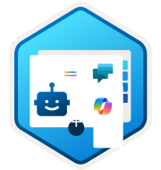
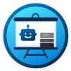

{: .note}
A curated list of links will help you get started with Copilot Studio. If you are a business user looking to create conversational AI applications without extensive programming knowledge, this will empower you to become a "citizen developer".

## Background and Overview

Microsoft Copilot Studio is a graphical, low-code tool designed to help users create and customize AI agents for various scenarios and channels. It allows users to build automation with Power Automate or extend existing Copilot Solutions like Microsoft 365 Copilot with enterprise data and scenarios. Copilot Studio connects to other data sources using prebuilt or custom plugins, creating sophisticated logic for powerful and intuitive agent experiences. You should use Copilot Studio when creating agents to perform tasks, interact with customers, or answer common employee questions. It is available as both a standalone web app and a discrete app within Teams.

The low-code/no-code approach offers several benefits, including quicker turnaround times, improved productivity, and reduced errors. It allows business users to create applications without extensive programming knowledge, empowering them to become citizen developers. This approach is important because it democratizes software development, enabling standard business users to build and launch applications up to 80% faster. Organizations can innovate more rapidly and efficiently by enabling citizen developers, reducing the strain on IT resources.

Copilot Studio provides extensibility for various copilots, including Microsoft 365 Copilot and Microsoft Dynamics 365 Customer Service Copilot. You can customize Microsoft 365 Copilot by building declarative agents and adding actions and knowledge with plugins and Microsoft Graph connectors. In Dynamics 365 Customer Service, Copilot can be extended to automate actions and workflows, providing real-time AI assistance to help agents handle cases efficiently. Additionally, Copilot Studio allows you to extend other copilots with over 1,100 prebuilt and custom connectors, eliminating the need for expensive IT resources.

Agents and autonomous agents are AI systems designed to perform tasks independently. An agent is a powerful AI companion that can handle a range of interactions and tasks, from resolving issues requiring complex conversations to autonomously determining the best action to take based on its instructions and context. On the other hand, autonomous agents are computational systems that inhabit complex dynamic environments, sense and act autonomously, and realize a set of goals or tasks for which they are designed. These agents can improve productivity by performing tasks to assist users and organizations, engaging with customers and employees across various channels.

***

*Photo by <a href="https://unsplash.com/@hansonluu?utm_content=creditCopyText&utm_medium=referral&utm_source=unsplash">Hanson Lu</a> on <a href="https://unsplash.com/photos/the-inside-of-an-airplane-with-a-control-panel-oP_2c31ZwPM?utm_content=creditCopyText&utm_medium=referral&utm_source=unsplash">Unsplash</a>*
      
## Where to start
### Copilot Studio in a Day Workshop

 Overview

The Copilot Studio in a Day Workshop is an intensive, instructor-led training designed to equip participants with the knowledge and hands-on experience necessary to use Microsoft Copilot Studio effectively. This workshop focuses on creating and customizing AI agents using Microsoft Power Platform, specifically Microsoft Copilot Studio and Power Automate.  

[Link](https://learn.microsoft.com/en-us/training/paths/power-virtual-agents-workshop/)

#### Summary of Lessons:

 **Plan Your First Agent**

In this module, you begin building your Microsoft Power Platform solution, starting with a basic agent. This lesson covers the initial planning and design of your agent, ensuring it meets your specific needs and objectives.
[Link](https://learn.microsoft.com/en-us/training/modules/plan-first-chatbot-online-workshop/)

 **Create Your First Agent in Microsoft Copilot Studio**

Learn how to create your first agent in Microsoft Copilot Studio. This lesson guides you through setting up your agent, configuring its basic functionalities, and deploying it.

[Link](https://learn.microsoft.com/en-us/training/modules/power-virtual-agents-create-online-workshop/)

 **Authoring 101: Writing in Unified Authoring**

This module teaches the fundamentals of message and question nodes, familiarizes you with system topics, and shows you how to use variables. It is essential for creating compelling and interactive agents.

[Link](https://learn.microsoft.com/en-us/training/modules/unified-authoring-online-workshop/)

 **Add Knowledge Sources to an Agent**

Enhance your agent with Copilot Studio by integrating external data, selecting intent recognition models, enabling Generative AI orchestration, and allowing the agent to use its own general knowledge. This lesson focuses on making your agent more versatile and effective by leveraging various data sources and AI capabilities.

[Link](https://learn.microsoft.com/en-us/training/modules/add-knowledge-copilots-online-workshop/)

 **Build Power Automate Flows for Your Agent**

Microsoft Copilot Studio connects with Power Automate, allowing you to pass variables from user responses, retrieve data from different sources, perform complex operations, and return the data to Copilot Studio. This lesson covers integrating Power Automate flows to enhance your agent's functionality.

[Link](https://learn.microsoft.com/en-us/training/modules/build-flows-chatbot-online-workshop/)

### Copilot Studio Hands-On Training

The Microsoft Copilot Studio Hands-On Workshop is designed to help participants build and extend their own copilots using Microsoft Copilot Studio. The workshop includes several labs, each focusing on different aspects of copilot development:

* **Create your first copilot** in Microsoft Copilot Studio.
* **Authoring 101**: Learn the basics of authoring in Copilot Studio.
* **Knowledge sources and custom instructions**: Integrate various knowledge sources and create custom instructions.
* **Build and Invoke Power Automate cloud flows**: Automate workflows using Power Automate.
* **Invoke AI Builder prompts**: Utilize AI Builder for advanced functionalities.
* **Make HTTP requests to connect to an API**: Learn how to connect to external APIs.
* **Use generative AI orchestration**: Interact with your connectors using generative AI.
* **Using topic inputs**: Enhance your copilot's capabilities with topic inputs.
* **Advanced generative orchestration**: Dive deeper into generative AI orchestration.

The workshop provides resources and documents to guide participants through each lab, ensuring a comprehensive learning experience
[Link](aka.ms/CopilotStudioWorkshop)

***

*Photo by <a href="https://unsplash.com/@jontyson?utm_content=creditCopyText&utm_medium=referral&utm_source=unsplash">Jon Tyson</a> on <a href="https://unsplash.com/photos/blue-and-black-arrow-signage--xcojCHOSTU?utm_content=creditCopyText&utm_medium=referral&utm_source=unsplash">Unsplash</a>*
      

## Kickstart your journey

* [Sign up for a Microsoft Copilot Studio trial](https://learn.microsoft.com/en-us/microsoft-copilot-studio/sign-up-individual)
  
* [Get access to Microsoft Copilot Studio - license overview](https://learn.microsoft.com/en-us/microsoft-copilot-studio/requirements-licensing-subscriptions)
  
* [the bot building handbook](https://aka.ms/PVAPlaybook)
  
* [envisioning worksheet](https://aka.ms/ConversationalAIWorksheet)
  
* [requirements gathering sheet](https://github.com/MicrosoftDocs/mslearn-developer-tools-power-platform/blob/master/in-a-day/PVA/PVA_Req_Template_Contoso_Coffee.zip)

* [Official blog](https:///CopilotStudioBlog)

* [Community forum](https:///CopilotStudioCommunity)

* [Product documentation](https:///CopilotStudioDocs)

* [GitHub repository of samples](https:///CopilotStudioSamples)

* [Demo Copilot Studio](https:///CopilotStudioDemo)

* [Try Copilot Studio](https:///TryCopilotStudio)

  
*** 

*Photo by <a href="https://unsplash.com/@alevtakil?utm_content=creditCopyText&utm_medium=referral&utm_source=unsplash">Alev Takil</a> on <a href="https://unsplash.com/photos/black-2-din-car-stereo-x6HpdNQ-iEM?utm_content=creditCopyText&utm_medium=referral&utm_source=unsplash">Unsplash</a>*
      
## Continue your Journey
### Overview of Building Agents
Learn about the best practices, methodologies, and practical tips for building agents. [Read more](https://learn.microsoft.com/en-us/microsoft-copilot-studio/guidance/building-agents-overview).

### Best Practices for Topics
Discover the best practices and methodologies for creating effective topics. [Read more](https://learn.microsoft.com/en-us/microsoft-copilot-studio/guidance/topics-best-practices).

### Optimal Trigger Phrases
Understand how to craft optimal trigger phrases to enhance agent interactions. [Read more](https://learn.microsoft.com/en-us/microsoft-copilot-studio/guidance/trigger-phrases-best-practices).

### Effective Slot Filling Techniques
Explore techniques for effective slot filling to improve agent responses. [Read more](https://learn.microsoft.com/en-us/microsoft-copilot-studio/guidance/slot-filling-best-practices).

### Transferring Agent Ownership
Learn how to transfer agent ownership efficiently. [Read more](https://learn.microsoft.com/en-us/microsoft-copilot-studio/guidance/reassign-copilot-to-a-new-owner).

### Displaying Array Data
Find out how to display array data effectively within your agents. [Read more](https://learn.microsoft.com/en-us/microsoft-copilot-studio/guidance/display-data-from-arrays).

### Incorporating Feedback in Responses
Discover methods to incorporate feedback into agent responses. [Read more](https://learn.microsoft.com/en-us/microsoft-copilot-studio/guidance/add-feedback-for-every-response).

### Passing Context Variables from Webpages
Learn how to pass context variables from web pages to your agents. [Read more](https://learn.microsoft.com/en-us/microsoft-copilot-studio/guidance/pass-context-variables-from-your-webpage-to-an-agent).

### Web Analytics Tracking ID Integration
Understand how to integrate web analytics tracking IDs with your agents. [Read more](https://learn.microsoft.com/en-us/microsoft-copilot-studio/guidance/pass-web-analytics-tracking-id-from-a-webpage).

### Introduction to Conversational Experiences
Get an introduction to designing conversational experiences. [Read more](https://learn.microsoft.com/en-us/microsoft-copilot-studio/guidance/introduction-to-conversational-experiences).

### Designing the Ideal Experience
Learn how to design the ideal conversational experience for your users. [Read more](https://learn.microsoft.com/en-us/microsoft-copilot-studio/guidance/design-the-ideal-experience).

### Practical Tips for Conversational Design
Explore practical tips for effective conversational design. [Read more](https://learn.microsoft.com/en-us/microsoft-copilot-studio/guidance/practical-tips-for-designing-a-conversational-experience).

### Engagement Measurement
Discover how to measure user engagement with your agents. [Read more](https://learn.microsoft.com/en-us/microsoft-copilot-studio/guidance/measuring-engagement).

### Outcome Measurement
Learn about measuring the outcomes of your agent interactions. [Read more](https://learn.microsoft.com/en-us/microsoft-copilot-studio/guidance/measuring-outcomes).

### Optimizing Deflection
Find out how to optimize deflection in your agent interactions. [Read more](https://learn.microsoft.com/en-us/microsoft-copilot-studio/guidance/deflection-optimization).

### Custom Analytics Strategies
Explore strategies for custom analytics in your agent projects. [Read more](https://learn.microsoft.com/en-us/microsoft-copilot-studio/guidance/custom-analytics-strategy).

### Best Practices for Projects
Learn the best practices for managing agent projects. [Read more](https://learn.microsoft.com/en-us/microsoft-copilot-studio/guidance/projects-best-practices).

### Getting Started with Projects
Get started with your agent projects using these guidelines. [Read more](https://learn.microsoft.com/en-us/microsoft-copilot-studio/guidance/project-getting-started).

### Building a Project Team
Understand how to build an effective project team for your agent projects. [Read more](https://learn.microsoft.com/en-us/microsoft-copilot-studio/guidance/building-a-team).

### Planning Your Project
Learn how to plan your agent projects effectively. [Read more](https://learn.microsoft.com/en-us/microsoft-copilot-studio/guidance/project-planning).

***

*Photo by <a href="https://unsplash.com/@brookecagle?utm_content=creditCopyText&utm_medium=referral&utm_source=unsplash">Brooke Cagle</a> on <a href="https://unsplash.com/photos/three-people-sitting-in-front-of-table-laughing-together-g1Kr4Ozfoac?utm_content=creditCopyText&utm_medium=referral&utm_source=unsplash">Unsplash</a>*
      
## Community Ressources
### Getting Started
These resources are perfect for newcomers to Copilot Studio, providing foundational knowledge and initial guidance.

#### [Microsoft Copilot Studio Resources](https://microsoft.github.io/copilot-studio-resources/)
A comprehensive collection of resources curated by Power CAT, aimed at supporting users at various stages of their Copilot Studio journey. It includes guides for beginners, best practices, and real-world customer stories.

#### [Create Agents with Microsoft Copilot Studio Learning Path](https://learn.microsoft.com/en-us/microsoft-copilot-studio/fundamentals-support)
A learning path designed to help users prepare for Exam PL-200: Microsoft Power Platform Functional Consultant. It includes training and certification preparation materials.

### Community Support
These resources offer community-driven support, forums, and opportunities to engage with other Copilot Studio users.

#### [Microsoft Copilot Studio Community Forums](https://learn.microsoft.com/en-us/microsoft-copilot-studio/fundamentals-support)
A platform where users can ask questions, share tips, and get help from other Copilot Studio users. It also provides options to submit ideas and provide product feedback.

#### [Discussions – MS Copilot UG – Dynamics Communities](https://dynamicscommunities.com/community/groups/ms-copilot/forum/topic/microsoft-copilot-studio-resources/)
A forum for discussions related to Copilot Studio, where users can find curated resources, samples, and best practices shared by the community.

### Best Practices and Advanced Usage
These resources focus on advanced techniques, best practices, and extending the capabilities of Copilot Studio.

#### [Extending M365 Copilot with Copilot Agents: Best Practices](https://microsoft.github.io/copilot-studio-resources/)
Guidelines and best practices for extending Microsoft 365 Copilot with custom agents, helping users get the most out of their enterprise knowledge.

#### [Unleash the Power of Copilot & Agents: Building with the New Agent Builder Experience](https://microsoft.github.io/copilot-studio-resources/)
A resource that provides insights into building agents with the new Agent Builder experience, including best-in-class connectors and practical examples.

### Real-World Applications
These resources showcase real-world use cases, customer stories, and practical applications of Copilot Studio.

#### [Real-World Customer Stories](https://microsoft.github.io/copilot-studio-resources/)
A collection of stories and case studies demonstrates how various organizations have successfully implemented Copilot Studio.

#### [Best Practices and Common Use Cases](https://microsoft.github.io/copilot-studio-resources/)
An overview of common use cases and best practices for using Copilot Studio, helping users understand how to apply the tool effectively in different scenarios.

### Newsletters
These newsletters provide updates, insights, and tips on Copilot Studio, informing users about the latest developments and best practices.

#### Copilot Studio Newsletter
Authored by Bülent Altinsoy, this newsletter provides updates and insights on Copilot Studio, including new releases and quick-start guides. [Link](https://www.linkedin.com/newsletters/copilot-studio-newsletter-7207150219837263872/)

